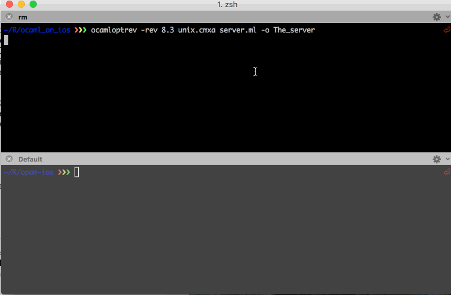

# opam-ios

This repository contains a compiler for OCaml on iOS.

# Usage

First create a fresh switch, it must be 4.02.0:

**NOTE** This is important, installation of `ocaml-xarm` is a
destructive operation. In this context it means that the later
installation of `ocaml-xarm` will delete the existing compilers, hence
we make a switch just for this package.

```shell
$ opam switch ios -A 4.02.0
```

Then add this repository with:

```shell
$ opam repository add ios git://github.com/fxfactorial/opam-ios
```

Now do:

**NOTE** This is a destructive install, hence I told you to make a
separate switch for this install.

```shell
$ opam install ocaml-xarm
```

Now you can compile OCaml that will run on the iPhone!

# Example

Here is a stupid server, mostly useful to show how one can use the
Unix module with no problem on the iPhone.

```ocaml
 1  open UnixLabels
 2  
 3  let () =
 4    let sock = socket ~domain:PF_INET ~kind:SOCK_STREAM ~protocol:0 in
 5    bind sock ~addr:(ADDR_INET (inet_addr_any, 3000));
 6    print_endline "About to listen";
 7    listen sock 5;
 8    let resp = "Thanks for the Test!\n" in
 9    let buf = String.create 255 in
10    while true do
11      let (listen_sock, listen_addr) = accept sock in
12      (ignore (read listen_sock ~buf ~pos:0 ~len:255));
13      print_endline buf;
14      (ignore @@ write listen_sock ~buf:resp ~pos:0 ~len:(String.length resp - 1));
15      Unix.close listen_sock
16    done
```

Compile with:

```shell
$ ocamloptrev -rev 8.3 unix.cmxa server.ml -o The_server
```

The -rev 8.3 refers to the iOS SDK. In this example I compiled for
8.3, note that this is just for paths, it will actually look for a
path like /Applications/Xcode.app&#x2026; Funny enough, even though this
was for 8.3, the code will work below that as well, I tested it on 8.3
and iOS 7.1; Xcode6.3.2 will give you the 8.3 SDK.

And here's an example of it working:



For an example of calling OCaml from Objective-C, see this [blog post](http://hyegar.com/blog/2016/01/23/calling-ocaml-from-objective-c-on-the-iphone/)

# Issues

This won't work with other opam packages just yet, I am still working
on that. The only thing you'll have at your disposal for now is the
OCaml standard library, which does include unix.

# Acknowledgments

The real heroes are Gerd Stolpmann, awesome guys at Psellos.com;
special shout out to Jeffrey Scofield.

Also thanks to @whitequark for his `opam-android` repo. Although I
ended up going in a different approach, his repo was a great starting
point for me.
